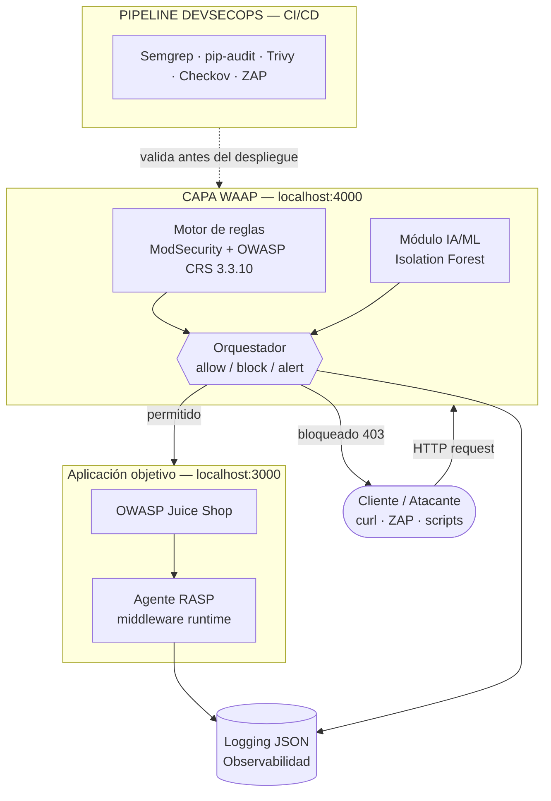

# Taller WAAP — Web Application and API Protection

**Universidad Distrital Francisco José de Caldas**  
Facultad de Ingeniería — Ingeniería de Sistemas  
Materia: Mecanismos de Seguridad Informática  
Profesor: Octavio J. Salcedo Parra  

## Integrantes

| Nombre | Correo |
|---|---|
| Javier Alejandro Penagos Hernandez | 20221020028 |
| Laura Daniela Muñoz Ipus | 20221020022 |
| Jhonatan David Moreno Barragan | 20201020094 |

---

## Descripción

Prototipo funcional de plataforma **WAAP (Web Application and API Protection)** que integra cuatro capas de defensa en profundidad:

| Capa | Tecnología | Estado |
|---|---|---|
| Motor de reglas (WAF) | ModSecurity + OWASP CRS 3.3.10 | [+] Fase 2 completa |
| Detección por IA/ML | Isolation Forest (scikit-learn) | [+] Fase 3 completa |
| Protección en ejecución (RASP) | Middleware Python (Flask/WSGI) | [+] Fase 4 completa |
| Pipeline DevSecOps | Runner local + workflow GitHub Actions (Semgrep, pip-audit, Trivy, Checkov, ZAP) | [+] Fase 5 completa |

La aplicación objetivo es **OWASP Juice Shop**, desplegada en un entorno de laboratorio local completamente aislado. Todos los ataques se ejecutan únicamente contra esta instancia controlada.

---

## Arquitectura



Flujo de una petición:
1. El motor de reglas (ModSecurity + OWASP CRS) evalúa la petición contra firmas conocidas.
2. El módulo IA/ML calcula un score de anomalía con Isolation Forest.
3. El orquestador combina ambos resultados y decide: permitir, bloquear o alertar.
4. Si pasa, el agente RASP intercepta operaciones peligrosas en tiempo de ejecución.
5. Todos los eventos se registran en JSON estructurado para observabilidad (Fase 7).

---

## Requisitos

### Software

| Componente | Versión mínima |
|---|---|
| Docker + Docker Compose | Docker 24+ |
| Python | 3.10+ |
| curl | cualquiera |

### Hardware sugerido

- CPU: 4 núcleos (recomendado 8)
- RAM: 8 GB mínimo, 16 GB recomendado
- Disco: 20 GB libres

---

## Estructura del repositorio

```
.
├── setup.sh                        # Bootstrap: crea .venv y .venv-tools
├── Makefile                        # Atajos: make all, make phase4, etc.
├── requirements.txt                # Dependencias unificadas (ML + RASP)
├── .env.example                    # Modo del WAF y umbrales (On por defecto)
├── docker-compose.yml              # Juice Shop + proxy WAAP
├── docs/                           # Documentación por fase
│   ├── fase-0-preparacion.md
│   ├── fase-1-app-vulnerable.md
│   ├── fase-2-waf-reglas.md
│   ├── fase-3-ia-ml.md
│   ├── fase-4-rasp.md
│   ├── fase-5-pipeline.md
│   ├── fase-6-evasion.md
│   └── fase-7-observabilidad.md
├── traffic_agent/                  # Módulo IA/ML (Fase 3)
│   ├── agent.py                    # Genera tráfico etiquetado contra el proxy
│   ├── features.py                 # Extracción de 9 features por petición
│   ├── train_model.py              # Entrena Isolation Forest → model.pkl
│   ├── evaluate_model.py           # Evalúa el modelo con métricas completas
│   ├── model.pkl                   # Modelo serializado (entregable Fase 3)
│   ├── requirements.txt
│   ├── generators/
│   │   ├── normal.py               # Generador de tráfico legítimo
│   │   └── attack.py               # Generador de ataques con variantes de encoding
│   ├── loaders/
│   │   ├── csic_loader.py          # Cargador dataset CSIC 2010
│   │   └── params_loader.py        # Cargador dataset HTTP Params
│   └── logs/
│       ├── traffic_dataset.csv     # 500 peticiones etiquetadas
│       ├── features_normal_traffic.csv
│       ├── evaluation_predictions.csv
│       └── evaluation_metrics.json
├── observability/                  # Logging JSON unificado y métricas (Fase 7)
│   ├── logger.py                   # Eventos JSON-lines de todas las capas
│   └── collect_metrics.py          # TP/FP/FN por capa, MTTD y tuning
├── app/                            # App instrumentada con RASP (Fase 4)
│   ├── vulnerable_app.py           # App Flask con operaciones sensibles
│   ├── rasp_agent.py               # Decoradores/guardas RASP
│   ├── run_rasp_tests.py           # Casos de prueba + latencia
│   ├── Dockerfile
│   └── requirements.txt
├── pipeline/                       # Pipeline DevSecOps (Fase 5)
│   ├── run_pipeline.py             # Runner local de las 6 puertas + despliegue
│   ├── verify_pipeline.py          # Ejercicio rojo/verde automatizado
│   ├── semgrep-rules.yaml          # Reglas SAST locales (offline)
│   └── .github/workflows/devsecops.yml
├── waap/rules/
│   └── waap_rules.yaml             # Policy as code (WAF + ML + RASP)
├── scripts/
│   ├── deploy_waap_rules.sh        # Despliegue condicionado al gate
│   ├── attack_matrix.py            # Matriz de evasión por capa (Fase 6)
│   └── collect_evidence.py         # Organiza logs/entrega/ + entrega.zip
└── README.md
```

---

## Inicio rápido

### 1. Levantar el entorno Docker

```bash
# Clonar el repositorio y entrar al directorio
cd ~/Documents/UD/Mecanismos

# Levantar Juice Shop (puerto 3000) + proxy WAAP ModSecurity (puerto 4000)
docker compose up -d

# Verificar que ambos contenedores están corriendo
docker compose ps
```

| Servicio | URL | Descripción |
|---|---|---|
| Juice Shop (directo) | http://localhost:3000 | Sin WAF — para pruebas de explotación base |
| WAAP Proxy | http://localhost:4000 | Con ModSecurity + OWASP CRS |

> El puerto 8080 está reservado por Burp Suite, por eso el proxy usa el 4000.

### 2. Configurar el entorno Python (módulo IA/ML)

```bash
cd traffic_agent

# Crear el entorno virtual
python3 -m venv envTrafficAgent

# Activar el entorno
source envTrafficAgent/bin/activate

# Instalar dependencias (incluye scikit-learn, joblib, numpy)
pip install -r requirements.txt
```

### 3. Generar tráfico y entrenar el modelo

```bash
# Con el entorno activado y docker compose corriendo:

# Paso 1: Generar 200 peticiones normales + 300 ataques contra el proxy
python agent.py

# Paso 2: Entrenar Isolation Forest con el tráfico normal capturado
python train_model.py

# Paso 3: Evaluar el modelo contra el dataset completo
python evaluate_model.py
```

### 4. Ejecutar la Fase 4 (RASP)

La Fase 4 no requiere Docker ni el laboratorio de Juice Shop: la app vulnerable y el agente RASP
corren como un proceso Flask local.

```bash
# Opción A: entorno dedicado (recomendado)
python3 -m venv envRasp
source envRasp/bin/activate
pip install -r app/requirements.txt

# Opción B: instalar sobre el entorno actual
pip install -r app/requirements.txt

# Ejecutar los casos de prueba y la medición de latencia
python app/run_rasp_tests.py
```

Genera:

| Archivo | Contenido |
|---|---|
| `logs/rasp_test_results.json` | Casos (SQLi fragmentado, XSS doble-encode, path traversal, deserialización) + latencia |
| `logs/rasp_latency.csv` | Muestras individuales de latencia RASP on/off |
| `logs/waap_events.jsonl` | Flujo estructurado de eventos, con `verdict: block` y `guard_ms` |

Para levantar la app manualmente y atacarla con `curl`:

```bash
python app/vulnerable_app.py            # http://127.0.0.1:5000 con RASP activo
PORT=5050 RASP_ENABLED=false python app/vulnerable_app.py   # sin RASP
```

Ejemplo de bloqueo en tiempo de ejecución:

```bash
# RASP activo → 403
curl -i "http://127.0.0.1:5000/api/Products/search?q=%27%20OR%201&extra=%3D1--"
```

### 5. Ejecutar la Fase 5 (pipeline DevSecOps)

```bash
# Herramientas del pipeline (una sola vez)
python3 -m venv envPipeline && source envPipeline/bin/activate
pip install semgrep pip-audit checkov
# Trivy y ZAP corren vía Docker; sin Docker esas etapas se omiten.

# Evaluar las puertas de seguridad y desplegar reglas si todo pasa
python pipeline/run_pipeline.py

# Ejercicio de verificación rojo/verde
python pipeline/verify_pipeline.py --mode sast
```

| Archivo | Contenido |
|---|---|
| `logs/pipeline_report.json` | Estado de cada etapa y resultado del gate |
| `logs/pipeline_verification.json` | Resultado del ejercicio (verde → rojo → verde) |
| `logs/waap_rules_deployed.json` | Marcador del policy as code desplegado |

### 6. Ejecutar la Fase 6 (matriz de evasión)

```bash
# Requiere el proxy Docker arriba y las dependencias ML (scikit-learn, joblib, pandas)
python scripts/attack_matrix.py
python scripts/attack_matrix.py --sqlmap   # opcional
```

| Archivo | Contenido |
|---|---|
| `logs/evasion_matrix.csv` | Matriz reglas / IA-ML / RASP por payload |
| `logs/evasion_matrix.json` | Detalle con scores y códigos HTTP (consumido por Fase 7) |

### 7. Ejecutar la Fase 7 (observabilidad y métricas)

```bash
python observability/collect_metrics.py
# con retardo de ingesta/SIEM simulado:
python observability/collect_metrics.py --ingest-delay-ms 25
```

| Archivo | Contenido |
|---|---|
| `logs/metrics_dashboard.json` | TP/FP/FN por capa, MTTD y recomendaciones |
| `logs/metrics_report.md` | Reporte legible con tablas |

---

## Ejecución integral (`make`)

Con Python 3.10–3.12 y Docker instalados, todo el laboratorio se ejecuta con un comando:

```bash
make setup        # crea .venv y .venv-tools e instala dependencias
make all          # setup -> lab-up -> phase3..7 -> lab-down
```

Objetivos individuales:

| Comando | Acción |
|---|---|
| `make lab-up` | Levanta Juice Shop + proxy WAAP (`On`) y espera al proxy |
| `make lab-up-detection` | Recrea el proxy en `DetectionOnly` (recolección Fase 3) |
| `make phase3` | Genera tráfico, entrena (`model.pkl`) y evalúa el modelo |
| `make phase4` | Casos RASP + latencia |
| `make phase5` | Pipeline DevSecOps + verificación rojo/verde |
| `make phase6` | Matriz de evasión por capa |
| `make phase7` | Panel de métricas y MTTD |
| `make collect` | Organiza las evidencias en `logs/entrega/` y genera `logs/entrega.zip` |
| `make lab-down` | Detiene el laboratorio |

> `make all` se detiene en la primera fase que falle (deja el laboratorio arriba; usa `make lab-down`).

### Evidencias ordenadas (`make collect`)

`make collect` consolida todos los artefactos por fase y empaqueta la entrega:

```
logs/entrega/
├── INDEX.md                 # índice + métricas clave y recomendaciones
├── fase-3-ia-ml/            # model.pkl, dataset, features, métricas
├── fase-4-rasp/             # resultados de casos + latencia
├── fase-5-pipeline/         # reportes del gate + reglas desplegadas (+ zap/sqlmap si existen)
├── fase-6-evasion/          # matriz de evasión
├── fase-7-metricas/         # panel y reporte de métricas
└── eventos/                 # waap_events.jsonl y un archivo por capa
```

El ZIP queda en `logs/entrega.zip`, listo para subir. Los artefactos faltantes se listan como
_no generado_ sin interrumpir el comando.

---

## Progreso por fases

### [+] Fase 0 — Preparación del entorno
- Contenedores `juice-shop` y `waap-proxy` corriendo.
- ModSecurity v3.0.16 + OWASP CRS 3.3.10 con 929 reglas cargadas.
- Acceso verificado en `localhost:3000` (directo) y `localhost:4000` (proxy).
- Documentación: [`docs/fase-0-preparacion.md`](docs/fase-0-preparacion.md)

### [+] Fase 1 — Aplicación vulnerable
Cinco vulnerabilidades identificadas y explotadas contra `localhost:3000`:

| # | Vulnerabilidad | OWASP Top 10 2021 | Endpoint |
|---|---|---|---|
| 1 | SQL Injection en login | A03 – Injection | `POST /rest/user/login` |
| 2 | XSS reflejado en búsqueda | A03 – Injection | `GET /rest/products/search?q=` |
| 3 | IDOR en pedidos | A01 – Broken Access Control | `GET /rest/basket/{id}` |
| 4 | API no documentada expuesta | A05 – Security Misconfiguration | `GET /api-docs`, `/api/Users` |
| 5 | Fuerza bruta sin límite | A07 – Auth Failures | `POST /rest/user/login` |

- Documentación: [`docs/fase-1-app-vulnerable.md`](docs/fase-1-app-vulnerable.md)

### [+] Fase 2 — WAF con motor de reglas
- Motor cambiado de `DetectionOnly` → `On` para bloqueo activo.
- SQLi `' OR 1=1--` bloqueado con `HTTP 403` (regla 942100, score anomalía = 5).
- XSS `<script>` directo bloqueado (regla 941100).
- **Caso de evasión:** XSS con doble URL encoding (`%2527...`) evade Paranoia Level 1 → `HTTP 200`.
- Documentación: [`docs/fase-2-waf-reglas.md`](docs/fase-2-waf-reglas.md)

### [+] Fase 3 — Detección por IA/ML

**Modelo:** Isolation Forest no supervisado entrenado sobre 200 peticiones normales reales.

**Features (9):** `status_code`, `response_time_ms`, `url_length`, `body_length`, `entropy`, `n_params`, `has_suspicious_chars`, `param_max_length`, `special_char_ratio`.

**Resultados sobre 500 peticiones (200 normales + 300 ataques):**

| Métrica | Valor |
|---|---|
| Accuracy | 86.00% |
| Recall (detección de ataques) | 83.33% |
| Precisión | 92.59% |
| F1 | 87.72% |
| Tasa de falsos positivos | 10.00% |
| ROC-AUC | 0.9217 |

- Artefacto: [`traffic_agent/model.pkl`](traffic_agent/model.pkl)
- Métricas: [`traffic_agent/logs/evaluation_metrics.json`](traffic_agent/logs/evaluation_metrics.json)
- Documentación: [`docs/fase-3-ia-ml.md`](docs/fase-3-ia-ml.md)

### [+] Fase 4 — Agente RASP

Agente en proceso (`app/rasp_agent.py`) con decoradores que inspeccionan el **valor final** antes de
ejecutarlo: consulta SQL concatenada, valor reflejado en HTML, ruta de archivo y blob serializado.
Bloquea con `HTTP 403` y registra cada decisión en JSON estructurado.

| Caso | RASP off | RASP on |
|---|---|---|
| SQLi fragmentado (`q=' OR 1` + `extra='=1--'`) | 200 — ejecuta `... OR 1=1--` | **403** |
| XSS doble-encode (evasión Fase 2) | 200 — `<script>alert(1)</script>` | **403** |
| Path traversal (`../outside_secret.txt`) | 200 — lee archivo externo | **403** |
| Deserialización (`__reduce__: os.system`) | 200 | **403** |

**Latencia** (150 muestras/escenario): RASP on 2.285 ms vs off 1.990 ms → **+0.294 ms (+14.8 %)**;
inspección interna del guard: **0.035 ms** de media. Tráfico legítimo sin falsos positivos.

- Artefactos: [`logs/rasp_test_results.json`](logs/rasp_test_results.json),
  [`logs/rasp_latency.csv`](logs/rasp_latency.csv), [`logs/waap_events.jsonl`](logs/waap_events.jsonl)
- Documentación: [`docs/fase-4-rasp.md`](docs/fase-4-rasp.md)

### [+] Fase 5 — Pipeline DevSecOps

Runner local (`pipeline/run_pipeline.py`) con seis puertas que bloquean el despliegue ante hallazgos
críticos: SAST (Semgrep), SCA (pip-audit), build (Docker), container scan (Trivy), IaC scan (Checkov)
y DAST (ZAP baseline). Solo si todas pasan se despliega el **policy as code**
(`waap/rules/waap_rules.yaml`) mediante `scripts/deploy_waap_rules.sh`.

- Degrada con aviso (`skipped`) si una herramienta no está instalada; `--strict` la convierte en fallo.
- `pipeline/verify_pipeline.py` automatiza el ejercicio: línea base verde → inyecta SQLi concatenada
  (falla `sast-semgrep`) o `PyYAML==5.3.1` (falla `sca-pip-audit`) → revierte → verde con despliegue.
- Workflow GitHub Actions equivalente en `pipeline/.github/workflows/devsecops.yml`.

- Reportes: [`logs/pipeline_report.json`](logs/pipeline_report.json),
  [`logs/pipeline_verification.json`](logs/pipeline_verification.json)
- Documentación: [`docs/fase-5-pipeline.md`](docs/fase-5-pipeline.md)

### [+] Fase 6 — Pruebas de evasión

`scripts/attack_matrix.py` genera la matriz comparativa por capa (reglas / IA-ML / RASP) sobre 10
payloads/técnicas: SQLi (clásico, URL-encode, doble-encode, fragmentado, comentarios), XSS (básico,
`onerror`, doble-encode), path traversal y ráfaga de bot. Las celdas de capas no disponibles se
marcan `N/A` en vez de contarse como evasión.

Hallazgos: el doble-encoding y la fragmentación evaden las reglas pero los bloquea el RASP; el SQLi
con comentarios en línea evade los patrones del RASP (hueco identificado); la ráfaga de bot no la
detecta ninguna capa (falta `req_per_minute`/rate limiting).

- Matriz: [`logs/evasion_matrix.csv`](logs/evasion_matrix.csv),
  [`logs/evasion_matrix.json`](logs/evasion_matrix.json)
- Documentación: [`docs/fase-6-evasion.md`](docs/fase-6-evasion.md)

### [+] Fase 7 — Observabilidad y métricas

`observability/logger.py` centraliza los eventos de todas las capas en `logs/waap_events.jsonl`
(JSON-lines con `layer`, `verdict`, `event`, `request_id`, `guard_ms`). `observability/collect_metrics.py`
consume la matriz de Fase 6, los eventos y las métricas del modelo, y calcula por capa TP/FP/FN/TN,
tasa de detección, FPR, FNR, precisión y **MTTD simulado**, más recomendaciones de tuning.

Resultado medido (proxy en `DetectionOnly` y sin `scikit-learn`; con `make lab-up` se completan las
columnas):

| Capa | TP | FP | FN | TN | Detección | FPR | FNR | MTTD |
|---|---|---|---|---|---|---|---|---|
| Reglas | 0 | 0 | 10 | 3 | 0 % | 0 % | 100 % | N/A |
| IA/ML | — | — | — | — | N/A | N/A | N/A | N/A |
| RASP | 8 | 0 | 1 | 3 | 88.9 % | 0 % | 11.1 % | 0.033 ms |
| **Combinada** | 8 | 0 | 2 | 3 | **80 %** | 0 % | — | — |

Huecos detectados: SQLi con comentarios en línea y ráfaga de bot (ninguna capa los cubre).

- Panel: [`logs/metrics_dashboard.json`](logs/metrics_dashboard.json),
  [`logs/metrics_report.md`](logs/metrics_report.md)
- Documentación: [`docs/fase-7-observabilidad.md`](docs/fase-7-observabilidad.md)

---

## Configuración Docker Compose

```yaml
services:
  juice-shop:
    image: bkimminich/juice-shop
    ports:
      - "3000:3000"

  waap-proxy:
    image: owasp/modsecurity-crs:nginx-alpine
    ports:
      - "4000:8080"
    environment:
      - BACKEND=http://juice-shop:3000
      - MODSEC_RULE_ENGINE=DetectionOnly   # Cambiar a "On" en Fase 2
      - PARANOIA=1
      - ANOMALY_INBOUND=5
      - ANOMALY_OUTBOUND=4
    depends_on:
      - juice-shop
```

---

## Marco normativo

- **OWASP Top 10 (2021)** — catálogo de riesgos para los casos de prueba.
- **MITRE ATT&CK T1190** — Exploit Public-Facing Application.
- **NIST SP 800-53** — controles SC-7 (Boundary Protection) y SI-4 (System Monitoring).
- **PCI DSS v4.0, requisito 6.4.2** — protección automatizada de aplicaciones web.
- **CIS Controls v8, control 16** — Application Software Security.

---

## Nota ética

Este laboratorio es de carácter exclusivamente académico y opera en un entorno aislado (red interna Docker). Todos los ataques se ejecutan únicamente contra OWASP Juice Shop desplegado localmente por el propio estudiante. Ninguna técnica documentada se aplica contra sistemas de terceros ni redes externas.

---

## Referencias

- OWASP Foundation. *OWASP Top 10:2021.* https://owasp.org/Top10/
- OWASP Foundation. *OWASP Core Rule Set (CRS).* https://coreruleset.org/
- OWASP Foundation. *OWASP Juice Shop.* https://owasp.org/www-project-juice-shop/
- MITRE. *ATT&CK Framework — T1190.* https://attack.mitre.org/
- scikit-learn developers. *Isolation Forest — User Guide.* https://scikit-learn.org/
- Gartner. *Market Guide for Cloud Web Application and API Protection.*
